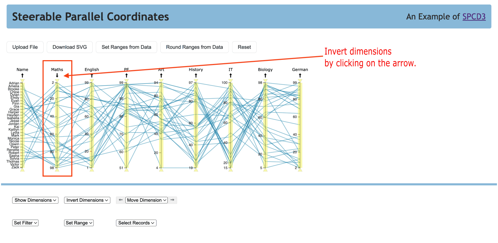
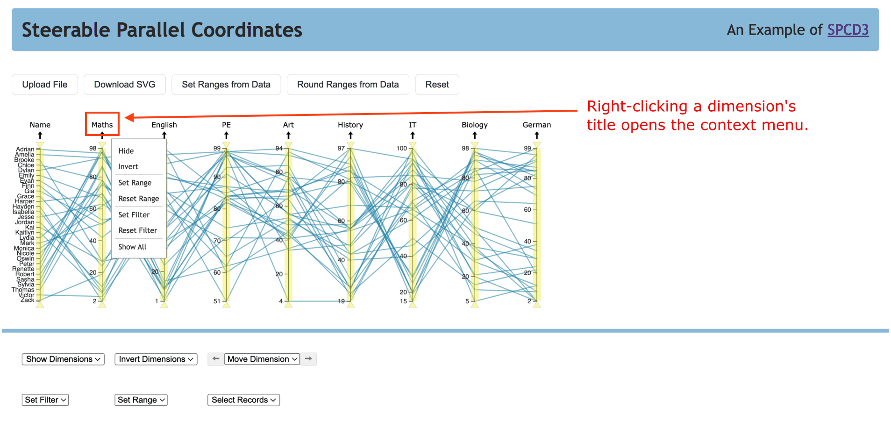

# Example Application of SPCD3

An example application is deployed to
[https://tugraz-isds.github.io/spcd3](https://tugraz-isds.github.io/spcd3),
It demonstrates the most important functions of the SPCD3 library. The
complete list of all available functions can be found in the
[API Guide](./API.md).
The example application loads an example dataset of student marks
and provides buttons and dropdown menus to manipulate the
parallel coordinates plot via the API.

## Student Marks Dataset

The example dataset is a fictitious dataset of student marks and was
created by Drescher et
al. [[2023]](https://courses.isds.tugraz.at/ivis/projects/ss2023/ivis-ss2023-g1-project-steerable-parcoords.pdf). It
consists of a header row, 30 rows of data (records), and 9 columns
(dimensions), including the name of the student. The dataset was
deliberately curated to contain interesting patterns and
relationships. Each row represents one student and their marks in 8
subjects. Each dimension, apart from the first, represents one
subject.

## Built-In Interactivity

There are several built-in functions to manipulate the visualisation.
The user can invert dimensions, move dimensions, hide dimensions,
adjust dimension ranges, filter records, hover over records, and
select records.

### Inverting Dimensions

By default, a dimension's axis places higher values at the top and
lower values at the bottom. A dimension can be inverted either by
clicking the arrow above the dimension axis or by right-clicking the
dimension name to activate the context menu and selecting
**Invert**. Inverting a dimension can be helpful to corroborate a
suspected correlation between adjacent dimensions.

### Moving Dimensions

When looking for correlations between dimensions, meaningful
relationships are only revealed between adjacent dimensions. Hence, it
is important to be able to move one dimension next to another
dimension of interest. In SPCD3, dimensions can be dragged and dropped
at the desired position.

### Open Context Menu

Each dimension in the application offers a versatile context menu, as
depicted in the next Figure. This menu is easily accessible with a
right-mouse click on the dimension name, providing a range of
options. Users can hide or invert the dimension, set or reset the
range, and set or reset the filter of the dimension. This flexibility
allows users to adapt the visualisation to their specific needs and
preferences.

Displaying too many dimensions can be overwhelming, so it is important
to be able to hide individual dimensions. A dimension can hidden by
right-clicking the dimension name to activate the context menu and
selecting **Hide**.

By default, the range of the dimension’s axis is set to the rounded
minimum and rounded maximum values present in the current dataset. The
user can adjust the range of a dimension from its context menu, where
two options are available: **Set Range** to set the range to
specific values and **Reset Range** to reset the dimension to the
original range.

### Filter Records

Records can be activated and deactivated by setting filters on one or
more dimensions. A double-edged range slider can be manipulated on
every dimension to filter out records by values on that dimension.
Records outside of the range are automatically deactivated and greyed
out. A further option is to set and reset filters from a dimension's
context menu: \uiname{Set Filter} sets a filter to specific values and
\uiname{Reset Filter} reset the filter to include all records.

### Hovering over Records

If there are a large number of records, a parallel coordinates
visualisation contains a large number of potentially crossing and
overlapping polylines, so it is challenging to recognise which
polyline belongs to which record. Hovering over one or more polylines
highlights the polyline(s) beneath the mouse pointer in red and
displays a tooltip with the labels of the corresponding records. By
default, the label is taken from the first column of the dataset.

### Select Records

It is helpful to be able to select one or more records in the dataset
and to highlight them accordingly. Left-clicking one or more polylines
selects the corresponding record(s) and highlights them in orange.
Shift-left-clicking adds one or more records to the current selection.
Control-left-clicking toggles the selection status of the
corresponding records. Left-clicking in empty space clears the current
selection.

## Steerable API

An essential part of the library is the steerable component, where
several UI controls are implmeneted to interact with the chart.
In the example application, the following API functions were
integrated:

- Uploading File
- Downloading SVG File
- Adjusting Dimension Ranges
- Resetting the Plot
- Showing and Hiding Dimensions
- Inverting Dimensions
- Moving Dimensions
- Setting Filter
- Selecting Records

Five buttons, located above the plot, serve specific functions. The
first button is for uploading a CSV file containing a dataset. The
second button enables downloading the plot as an SVG file. The
remaining three buttons facilitate resetting the ranges of all
dimensions to their original or rounded range, respectively and
resetting the entire plot.

Six additional functionalities are available below the plot. Clicking
on **Show Dimension** opens a box where users can control the
visibility of one or more dimensions. All dimensions are visible by
default, and with this feature, a more customised plot view is
available.

Clicking on **Invert Dimensions** opens a box with all dimensions,
where one or more dimensions can be inverted.

A dropdown menu was implemented for **Moving Dimensions** where a
single dimension can be selected, and with the arrows on the left and
right, the dimension can be moved to the corresponding side.

**Filtering records** is a breeze with the application by using the
  dropdown menu to choose a dimension. After selecting a dimension,
  two input fields appear, where a minimum and maximum value can be
  easily entered. Information about the filter range is shown, making
  it easy to understand the impact of the filter. Similar to the set
  filter, a Set Range is implemented, and information about the
  original range is shown.

By clicking on **Select Record(s)**, a box with all records opens,
where one or more records can be selected. When a record is selected,
the associated polyline is highlighted in orange.

