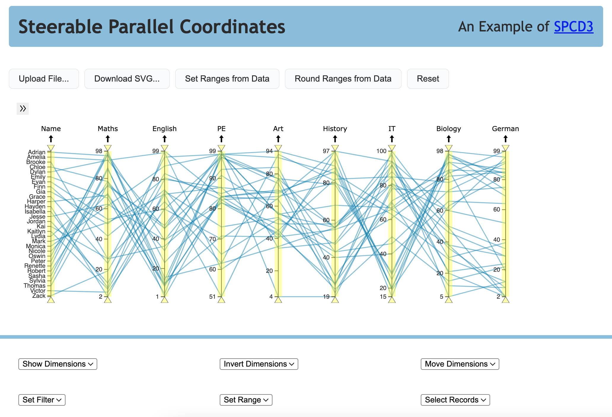

# Steerable Parallel Coordinates in D3 (SPCD3)

SPCD3 is an open-source JavaScript library which implements a
steerable parallel coordinates visualisation. The visualisation has
built-in interactive controls as well as an API which allows the
visualisation to be controlled (steered) externally. The library is
written in TypeScript and is based on [D3](https://d3js.org/).

In addition, a simple example program is provided to illustrate how to
use the library and its steerable API. A live version of the latest
deployment can be found at
[https://tugraz-isds.github.io/spcd3](https://tugraz-isds.github.io/spcd3).



## Dependencies

The SPCD3 library uses the following D3v7 modules:
- d3-dsv
- d3-selection
- d3-drag
- d3-shape
- d3-axis
- d3-scale
- d3-transition

In addition to D3, the following JavaScript libraries are used:
 - [Mini SVG data: URI](https://github.com/tigt/mini-svg-data-uri#readme):
   To convert SVGs into data URIs.
 - [xml-formatter](https://github.com/chrisbottin/xml-formatter#readme):
   To prettify the SVG file of the parallel coordinate plot for download.

The task runner [Gulp](https://gulpjs.com/) is used to automate
repeatable tasks and [Rollup](https://rollupjs.org/)
is used to bundle and build the library.


## Getting Started

### Prerequisites

Open terminal and execute the following command to install all the dependencies:


``` 
yarn
```

### Build And Development

Gulp is used to automate repeatable tasks. The file [gulpfile.js](gulpfile.js)
defines four public tasks:

<br/>

`clean` removes the existing `dist/` directory in
order to enable a clean rebuild of the project:
```
npx gulp clean
```

<br/>

`cleanAll` restores the project folder to its virgin state,
by deleting the existing `dist/` and `node_modules/` directories
and the `yarn.lock` file:
```
npx gulp cleanAll
```

<br/>

`build` creates a new build of the library in three formats (CJS, ESM, IIFE)
and stores the generated library packages into the `dist/library/` folder.
Additionally, the example folder is copied to `dist/example/`:
```
npx gulp build
```

<br/>

`serve` executes the build task, then additionally executes a private task
called watcher, which starts live web server in the `dist/example/` folder:
```
npx gulp serve
```

<br/>

Each of the public Gulp tasks can also be invoked by running the
equivalent npm script defined in package.json.

**Important:** To run the build, a live web server must be started.

## Usage

As mentioned in the beginning, an example was implemented to show how
the library works and what the parallel coordinate plot will look like
in addition to the library.

The [API Guide](./API.md) lists all available functions in SPCD3's
API.

An example application was built to illustrate the use of the SPCD3
library. It is described in the [Example Application
Guide](./EXAMPLE.md).


## Data-Handling

A CSV file is required to visualise a dataset as a parallel coordinate
plot. The CSV should be separated by a comma. Otherwise, there are no
special requirements. Data dimensions can be categorical or
numerical. Three example datasets can be found in folder
[data](./src/example/data/). Other datasets should have the same
structure.


## License

SPCD3 is distributed under the MIT License. See [LICENSE](LICENSE) for
more information.


## Contributors

- Keith Andrews [kandrews@iicm.edu](mailto:kandrews@iicm.edu?subject=Rslidy)  
  Project Leader

- Romana Gruber  
  Master's Thesis, main developer

- Philipp Drescher, Jeremias Kleinschuster, Sebastian Schreiner, Burim Vrella  
  InfoVis SS 2023 G1


