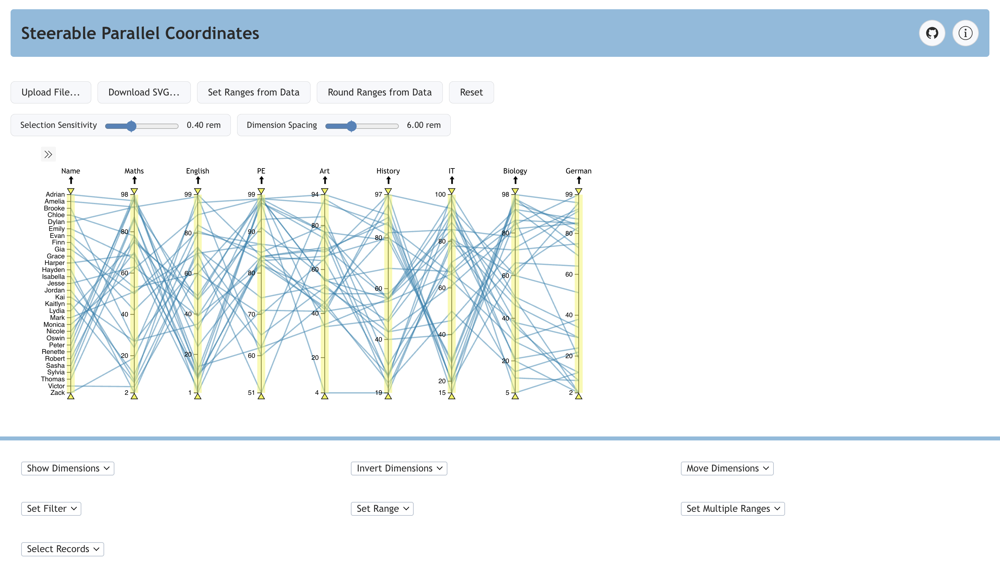

# Steerable Parallel Coordinates in D3 (SPCD3)

SPCD3 is an open-source JavaScript library which implements a
steerable parallel coordinates visualisation. The visualisation has
built-in interactive controls as well as an API which allows the
visualisation to be controlled (steered) externally. The library is
written in TypeScript and is based on [D3](https://d3js.org/).

In addition, a simple example program is provided to illustrate how to
use the library and its steerable API. A live version of the latest
deployment can be found at
[https://tugraz-isds.github.io/spcd3](https://tugraz-isds.github.io/spcd3).



## Dependencies

The SPCD3 library uses the following D3v7 modules:

- d3-dsv
- d3-selection
- d3-drag
- d3-shape
- d3-axis
- d3-scale
- d3-transition
- d3-ease
- d3-interpolate-path

In addition to D3, the following JavaScript library is used:

- [xml-formatter](https://github.com/chrisbottin/xml-formatter#readme):
  To prettify the SVG file of the parallel coordinate chart for download.

The task runner [Gulp](https://gulpjs.com/) is used to automate
repeatable tasks and [Rollup](https://rollupjs.org/)
is used to bundle and build the library.

## Getting Started

### Prerequisites

Open terminal and execute the following commands to install all the dependencies:

```
corepack enable
yarn install
```

### Build And Development

Gulp is used to automate repeatable tasks. The file [gulpfile.js](gulpfile.js)
defines seven public tasks:

<br/>

`build` creates a new build of the library in three formats (CJS, ESM, IIFE)
and stores the generated library packages into the `dist/library/` folder.
Additionally, the example folder is copied to `dist/example/`:

```
yarn build
# or
yarn exec gulp build
```

To run the example, a live web server must be started in the
folder `dist/example/`.

<br/>

`dev` executes the build task, and then additionally executes a private task
called watcher, which starts a live web server in the `dist/example/` folder:

```
yarn dev
# or
yarn exec gulp dev
```

<br/>

`clean` removes the existing `dist/` directory in
order to enable a clean rebuild of the project:

```
yarn clean
# or
yarn exec gulp clean
```

<br/>

`cleanAll` restores the project folder to its virgin state,
by deleting the existing `dist/`, `package/`, `node_modules/`
and `src-tauri/target/` directories:

```
yarn cleanAll
# or
yarn exec gulp cleanAll
```

<br/>

`icons` regenerates the file `src/lib/icons/icons.ts` from the SVG sources in
`src/lib/icons/svg/`. This task is also executed as part of the `build` task.
Run it whenever an icon is added, removed, or modified:

```
yarn icons
# or
yarn exec gulp icons
```

<br/>

### Build a native desktop app

Prerequisites: To build a native desktop app, Rust, Cargo and Tauri 2.0 needs to be installed.

`tauri` builds a native desktop app with Tauri 2.0 and copies the executable to `package/`:

```
yarn tauri
# or
yarn exec gulp tauri
```

<br/>

`cleanTauri` removes the `src-tauri/target/` directory to
enable a clean build of the native desktop app:

```
yarn cleanTauri
# or
yarn exec gulp cleanTauri
```

## Usage

SPCD3 includes an example application that demonstrates how the library is
used and what a parallel coordinates chart built with SPCD3 looks like.

The [SPCD3 API Guide](./README-API.md) lists all available functions in SPCD3's API.

The example application is described in the [SPCD3 Example Application
Guide](./README-EXAMPLE.md).

Note: SPCD3 includes its own [`reset.css`](./src/lib/reset.css), which is
imported by the library together with [`stylesheet.css`](./src/lib/stylesheet.css).

## Data-Handling

A CSV file is required to visualise a dataset as a parallel coordinate
chart. The CSV should be separated by a comma. Otherwise, there are no
special requirements. Data dimensions can be categorical or
numerical. Three example datasets can be found in folder
[data](./src/example/data/). Other datasets should have the same
structure.

## License

SPCD3 is distributed under the MIT License. See [LICENSE](LICENSE) for
more information.

## Contributors

- Keith Andrews [kandrews@iicm.edu](mailto:kandrews@iicm.edu?subject=Rslidy)  
  Project Leader

- Romana Gruber  
  Master's Thesis, main developer

- Philipp Drescher, Jeremias Kleinschuster, Sebastian Schreiner, Burim Vrella  
  InfoVis SS 2023 G1
