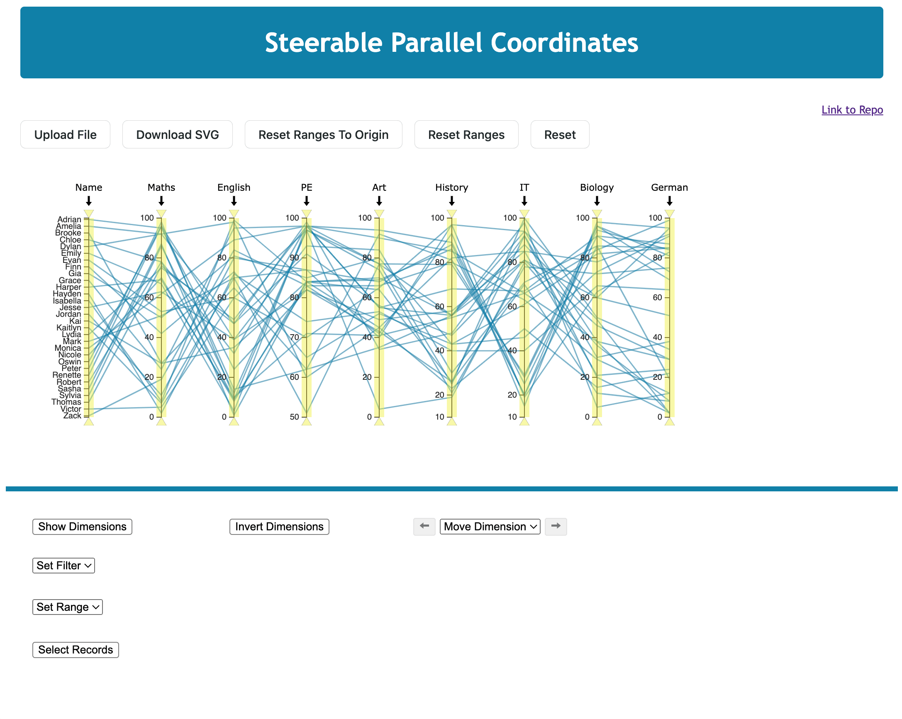

# Example Application of the Library 'Steerable Parallel Coordinates in D3'

An example application is implemented to show how the library works. Not all functions are shown, but most of them. We use the 'student-marks.csv' dataset to provide an overview of the library.

## Data-Handling

A CSV file is required to visualise a dataset as a parallel coordinate plot. The CSV should be separated by a comma. Otherwise, there are no special requirements. The data can be of categorical or numerical origin. In the folder [data](../example/data/), three example datasets can be viewed. Other datasets should have the same structure.

## Student Example

The student dataset shows several implemented functions. It consists of 9 dimensions and 30 data records. Each record represents one student and their assessment in 8 different subjects.

By launching the example, which is also deployed on [spcd3.netlify.app](https://spcd3.netlify.app/), the start screen appears, where a parallel coordinate plot is generated of the student dataset.

Now, it is possible to download the plot or interact with it.

## Interactivity within the Plot

Within the plot, it is possible to perform several actions.
The actions are: 
- Invert Dimension(s)
- Move Dimension(s)
- Hide Dimension(s)
- Set the Range of a Dimension
- Filter Records
- Hover over Record(s)
- Select Record(s).

### Invert a Dimension

To invert a dimension, the user has to click on the arrow at the top of the dimension axis. In the following screenshot, the dimension 'Maths' is inverted. Of course, clicking the arrow again returns it to the non-inverted state.

### Move a Dimension

To find all relevant insights and relationships, the application also offers the option of moving dimensions by dragging a dimension to the desired position.

### Filter Records

A further important interaction is to filter records. Therefore, we implement on each dimension axis a filter function, where the triangles can moved by dragging to the bottom and top. Besides, dragging the whole area to the bottom and top is possible.

### Open Context Menu

When a dimension is clicked on with a right mouse click, a context menu opens. The user can hide, invert, set the dimension's range, set the dimension's filter, and reset the filter.

For each dimension, we implement a context menu. The context menu opens with a right mouse click on the dimension name. In the context menu, it is also possible to hide dimensions, invert dimensions, and set and reset the filter of the dimension. By clicking on hide, the dimension disappears. Within the plot, there is no possibility to show the hidden dimension again. The dimension’s range can be set and reset to the original range.

When clicking on **Set Range**, for example, a popup window appears. In this window, a new minimum and maximum range can be entered. It is also possible to reset the dimension to the original range.

### Hover over Record(s)

A parallel coordinate plot usually consists of many polylines, so it is challenging to recognise which polyline belongs to which record. Therefore, hovering over records is implemented, where the labels are shown, and the polylines are highlighted in red. The records of the student dataset, for example, are identified over the name.

### Select Record(s)

With **Select**, one or more records can be selected. The selected record(s) are highlighted with a colour change.

## Interactivity outside the Plot

An essential part of our library is to interact with the plot from the outside. In our example application, we decided to integrate the following functions:

- Upload File
- Download SVG
- Reset Ranges
- Reset Plot
- Show and Hide Dimension
- Invert Dimension
- Move Dimension
- Set Filter
- Set Range
- Select Record(s)

The complete list of all available functions can be found [here](../../API.md).

Above the plot, five buttons exist. One button is for uploading a file. The second button allows to download the plot as SVG. The other two buttons allow to reset the ranges of all dimensions to their original range and rounded range and reset the whole plot to its origin.

Six additional functionalities are implemented below the plot. By clicking on **Show Dimension**, a box with all dimensions opens, where one or several dimensions can be hidden or shown. By default, all dimensions are shown.

Clicking on **Invert Dimensions** opens a box with all dimensions, where one or several dimensions can be inverted. In our example application, there are three different ways to invert a dimension.

A further necessary functionality is **moving dimensions**. For that, we implemented a dropdown menu where a single dimension can be selected. With the arrows, the dimension can be moved to the left or right.

We also implemented a dropdown menu to **filter records** where one dimension can be chosen. After selecting a dimension, two input fields appear, where it is possible to enter a minimum and maximum value. Besides, information about the filter range is shown. Similar to the set filter, a **set range** is implemented, and also information about the original range is shown.

The last functionality implemented is a **select record(s)** by clicking on Select Record(s), a box with all records opens, where one or several records can be selected. When a record is selected, the associated polyline is highlighted in orange.

