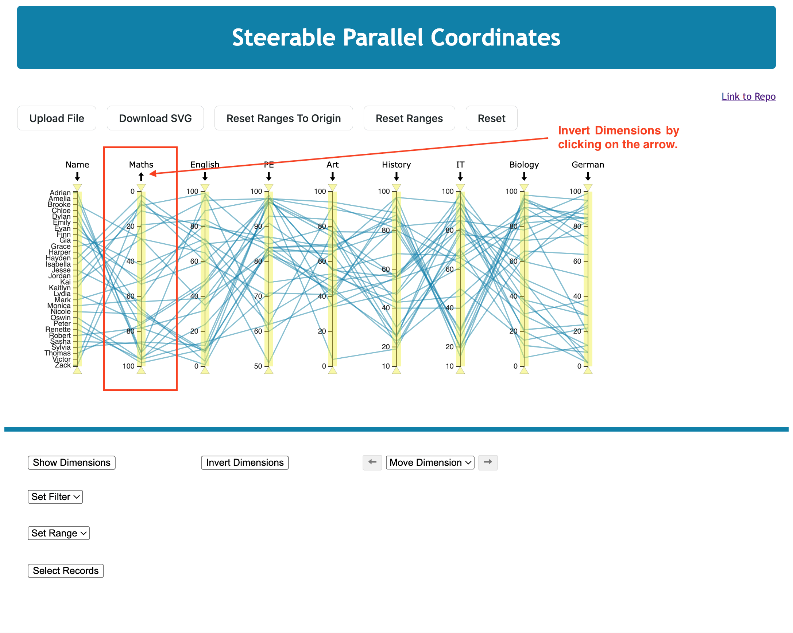
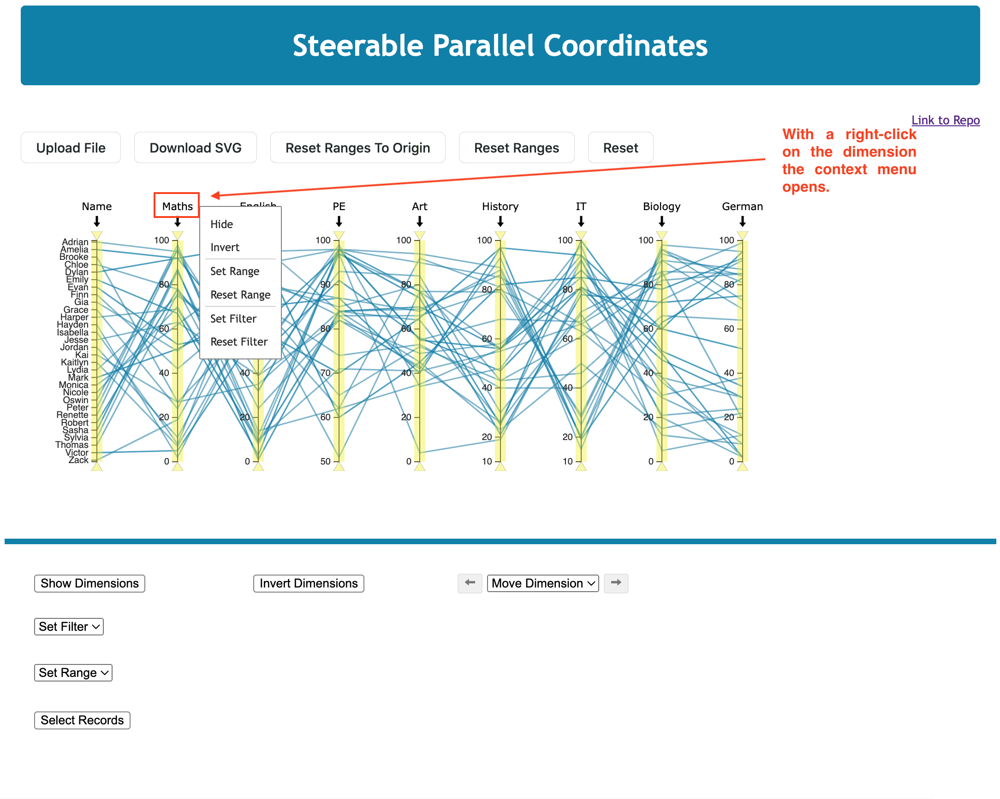

# Example Implementation of the Library 'Steerable Parallel Coordinates in D3'

An example is implemented to show how the library works. Not all functions are shown, but most of them.

## Data-Handling

A CSV file is required to visualise a dataset as a parallel coordinate plot. The CSV should be separated by a comma. Otherwise, there are no special requirements. The data can be of categorical or numerical origin. In the folder 'data,' three example datasets can be viewed. Other datasets should have the same structure.

## Student Example

The student dataset shows several implemented functions. It consists of 9 dimensions and 30 data records. Each record represents one student and their assessment in 8 different subjects.

By launching the example, which is also deployed on [spcd3.netlify.app](https://spcd3.netlify.app/), the start screen appears, where a button is shown to upload a CSV.

After uploading the file, the parallel coordinates plot is generated.

Now, the user can download the plot, interact with it, and use the functionalities at the bottom, where the plot can also be changed.

## Interactivity in the Plot

Within the plot, a user can perform several actions. The user can invert a dimension, move a dimension, filter a dimension, hide a dimension, or set the range of a dimension.

### Invert a Dimension

To invert a dimension, the user has to click on the arrow at the top of the dimension axis. In the following screenshot, the dimension 'Maths' was inverted.

### Move a Dimension

It is possible to move a dimension by dragging the dimension.

### Filter Dimension

Users can filter each dimension by dragging the triangles to the bottom or top. The screenshot below provides an example.

### Open Context Menu

A context menu opens when a dimension is clicked on. The user can hide, invert, set the dimension's range, set the dimension's filter, and reset the filter.

When clicking on the set range, a popup window appears. In this window, the user can set a new range by choosing a new minimum and maximum range. He can also reset to the original range.

## Interactivity outside the Plot

Below the plot, there are several possibilities for changing it. The user can invert a dimension, change its visibility, move a dimension, set the filter, and set the range of a dimension.