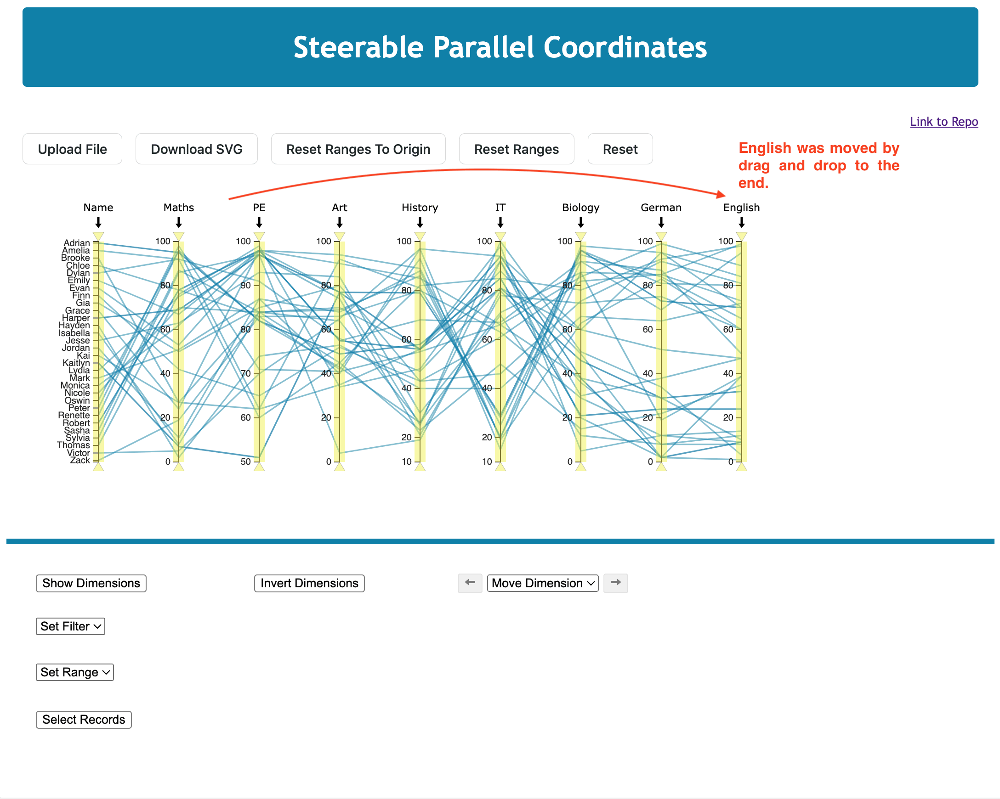
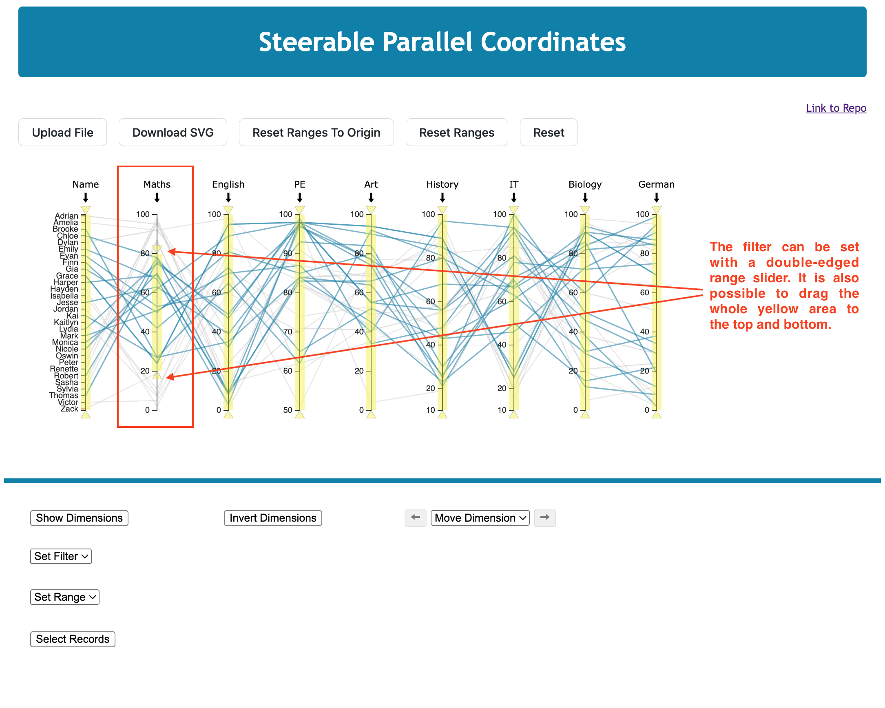
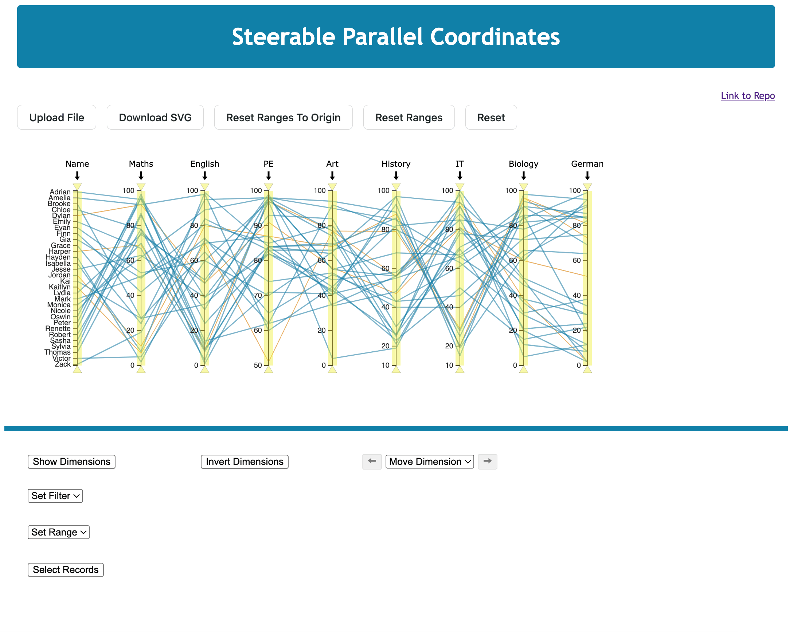

# Example Application of the Library 'Steerable Parallel Coordinates in D3'

An example application, which is also deployed on [spcd3.netlify.app](https://spcd3.netlify.app/), with the most important functions was implemented to demonstrate most of the library’s functionality. The complete list of all available functions can be found [here](../../API.md). The example application provides an example plot showing an example dataset upon initial load so that the user can familiarise themselves with the library and its functionalities.

## Data-Handling

A CSV file is required to visualise a dataset as a parallel coordinate plot. The CSV should be separated by a comma. Otherwise, there are no special requirements. The data can be of categorical or numerical origin. In the folder [data](../example/data/), three example datasets can be viewed. Other datasets should have the same structure.

## Student Marks Example

The example dataset is a fictitious dataset of student marks and was created by Drescher et al. [2023](https://courses.isds.tugraz.at/ivis/projects/ss2023/ivis-ss2023-g1-project-%20steerable-parcoords.pdf). It consists of a header row, 30 rows of data (records), and 9 columns (dimensions), including the name of the student. The dataset was deliberately curated to contain interesting patterns and relationships. Each row represents one student and their marks in 8 subjects. Each dimension, apart from the first, represents one subject.

Now, it is possible to download the plot or interact with it.

## Interactivity Within the Plot

Within the plot, it is possible to perform following actions.
The actions are: 
- Inverting Dimension(s)
- Moving Dimension(s)
- Context Menu with several options (Hiding Dimension(s), Inverting Dimension(s), Setting/Resetting Ranges, Setting/Resetting Filter)
- Filtering Records
- Hovering over Record(s)
- Selecting Record(s).

### Inverting Dimension(s)

By default, a dimension’s axis places higher values at the top and lower values at the bottom. Inverting a dimension flips the scale. This can be helpful to corroborate a suspected correlation between adjacent dimensions. However, axes with numerical data and categorical ones can be inverted.

The dimension can be inverted by clicking the arrow at the top of a dimension axis. This can be seen in the Figure below, where, for example, the dimension Maths is inverted. Of course, clicking the arrow again returns the dimension to the non-inverted state.

### Moving Dimension(s)

When looking for correlations between dimensions, meaningful relationships are only revealed between adjacent dimensions. Hence, it is important to be able to move one dimension next to another dimension of interest.

The application allows moving dimensions by dragging a dimension to the desired position, as shown in the next Figure. With that, all possible pairwise combinations could be found and compared.

### Open Context Menu

Each dimension in the application offers a versatile context menu, as depicted in the next Figure. This menu is easily accessible with a right-mouse click on the dimension name, providing a range of options. Users can hide or invert the dimension, set or reset the range, and set or reset the filter of the dimension. This flexibility allows users to adapt the visualisation to their specific needs and preferences.

Displaying too many dimensions can be overwhelming, so it is important to be able to show and hide individual dimensions. By clicking on hide in the context menu, the dimension is in the hidden state.

By default, the range of the dimension’s axis is set to the minimum and maximum values which are present in the current dataset. So, if student marks in English are between 0 and 100, but the worst performing student achieved 3 out of 100, and the best 95 out of 100, then the axis range would show 3 to 95.

When clicking on **Set Range** in the context menu, a user can adjust the dimension range, as shown in the Figure below. It is also possible to reset the dimension to the original range.

### Filtering Records

The example application empowers users to deactivate records simply setting filters on one or more dimensions. This is achieved through a user-friendly double-edged range slider that overlays the dimension. Records outside of the range are automatically deactivated and greyed out, as shown in the Figure below.

### Hovering over Record(s)

A parallel coordinate plot usually consists of many polylines, so it is challenging to recognise which polyline belongs to which record. Therefore, hovering over records is implemented, where the labels are shown and the polylines are highlighted in red. The records of the student dataset, for example, are identified over the name, see Image below.

### Select Record(s)

It is helpful to select one or more records in the dataset and highlight them accordingly. The selected records are highlighted by left-clicking on one or several polylines and changing their colour to orange, as shown in the Figure below. If multiple polylines overlap, multiple records are selected with a single click. With a shift-click it is possible to create a selection.

## Interactivity Outside the Plot

An essential part of the library is to interact with the plot from the outside. In the example application, the following functions were integrated:

- Uploading File
- Downloading SVG File
- Resetting Ranges
- Resetting Plot
- Showing and Hiding Dimension(s)
- Inverting Dimension(s)
- Moving Dimension(s)
- Setting Filter
- Setting Range
- Selecting Record(s)

Five buttons, located above the plot, serve specific functions. The first button is for uploading a file, specifically CSV files. The second button enables downloading the plot as an SVG file. The remaining three buttons facilitate resetting the ranges of all dimensions to their original or rounded range, respectively and resetting the entire plot.

Six additional functionalities are available below the plot. Clicking on **Show Dimension** opens a box where users can control the visibility of one or more dimensions. All dimensions are visible by default, and with this feature, a more customised plot view is available.

Clicking on **Invert Dimensions** opens a box with all dimensions, where one or more dimensions can be inverted.

A dropdown menu was implemented for **Moving Dimensions** where a single dimension can be selected, and with the arrows on the left and right, the dimension can be moved to the corresponding side.

**Filtering records** is a breeze with the application by using the dropdown menu to choose a dimension. After selecting a dimension, two input fields appear, where a minimum and maximum value can be easily entered. Information about the filter range is shown, making it easy to understand the impact of the filter. Similar to the set filter, a Set Range is implemented, and information about the original range is shown.

By clicking on **Select Record(s)**, a box with all records opens, where one or more records can be selected. When a record is selected, the associated polyline is highlighted in orange.